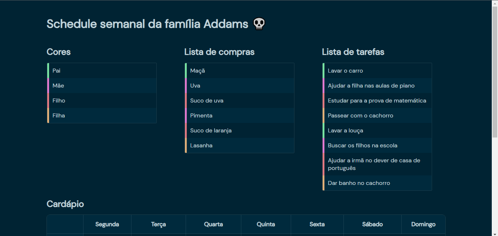
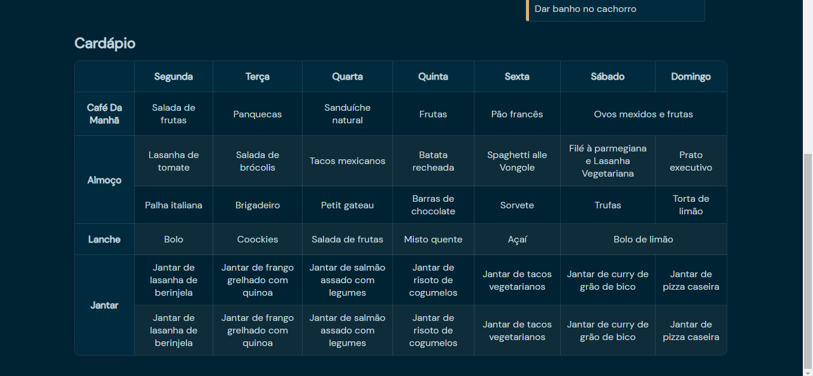

# Organização da rotina familiar

Objetivo: criar uma página para visualizar as informações da sua organização da rotina da familia.
## Deploy
Deploy feito utilizando o github pages. [Acesse a versão live do projeto aqui](https://afraniocaires.github.io/Exercicios-Ada/Aula-02/).
### Screenshots

## Sobre a atividade

Considerando nosso desafio, vamos criar uma página para visualizar as informações da sua organização da rotina da familia.

Aqui estão algumas informações sobre eles:

- O pai é vegetariano e gosta de cozinhar pratos saudáveis. Ele também pratica esportes e precisa de alimentos ricos em proteínas.
- A mãe é alérgica a nozes e frutos do mar, mas gosta de comida picante.
- O filho adolescente está em uma fase de crescimento e precisa de lanches saudáveis para levar para a escola.
- A filha de 10 anos adora comida italiana e está aprendendo a tocar piano.

## Requisitos:

1. Para facilitar a visualização, utilize cores diferentes para cada membro da família. Use esse padrão nas listas e no cardápio.
2. Liste os itens de supermercado necessários para satisfazer as necessidades alimentares de todos os membros da família durante a semana.

3. Crie um cardápio semanal que inclua pratos que agradem a todos e leve em consideração as preferências alimentares e atividades de cada um.
   
4. Elabore uma lista, conforme o modelo abaixo, de afazeres para a semana, distribuindo tarefas como cozinhar, fazer compras, levar o filho à escola, praticar esportes, ajudar a filha com as aulas de piano, etc.  
   
